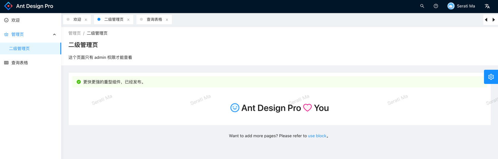
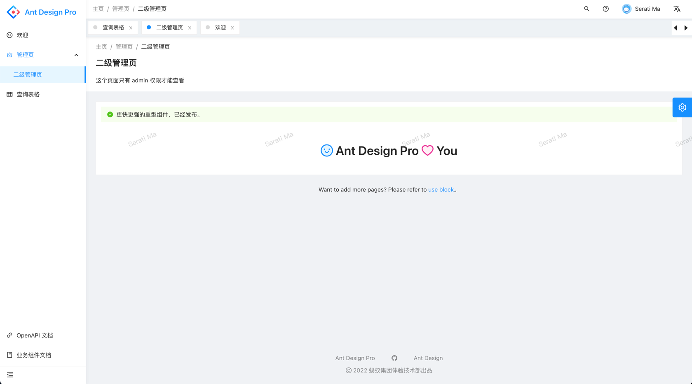
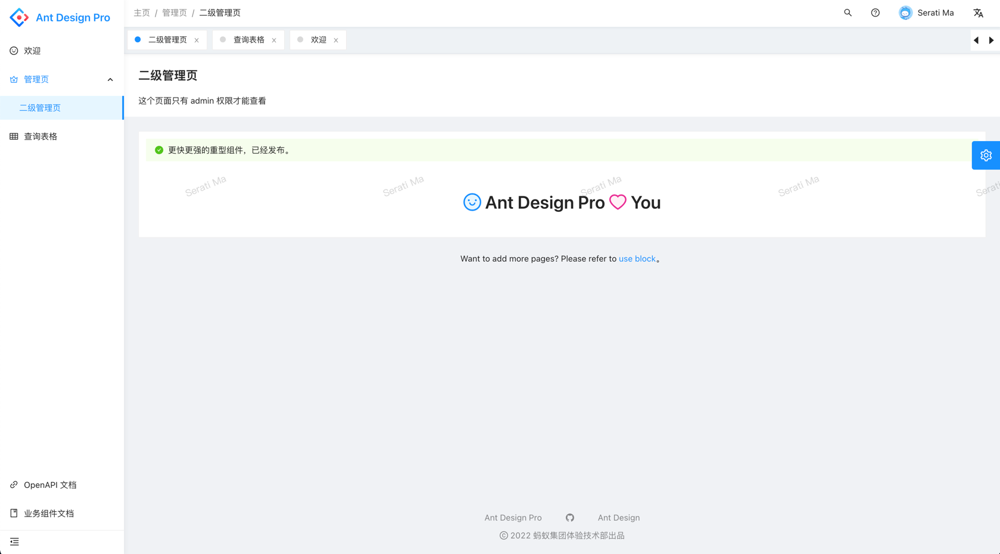
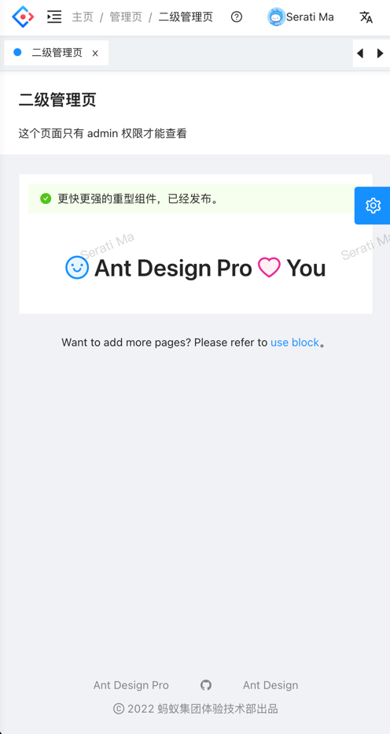
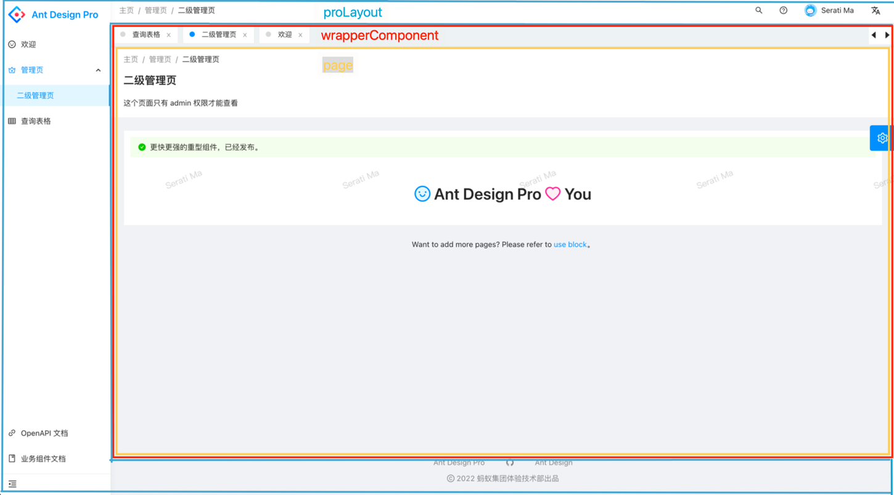

# Antd Pro use KeepAlive in umi

## 尝试
1. 安装依赖
```base
yarn add ahooks
yarn add umi-plugin-keep-alive
yarn && yarn start
```

2. 注册插件
```base
+ /config/config.ts

// https://umijs.org/config#plugins
plugins: ['./src/components/PanelTabsKeepAlive/plugin.ts'],
```

3. 补充 layout 样式
```base
+ src/app.tsx 

import {ProBreadcrumb} from '@ant-design/pro-layout';

// ProLayout 支持的api https://procomponents.ant.design/components/layout
export const layout: RunTimeLayoutConfig = ({ initialState }) => {
  return {
    disableContentMargin: true,
    breadcrumbRender: (routers = []) => [
      {
        path: '/',
        breadcrumbName: '主页',
      },
      ...routers,
    ],
    headerContentRender: () => <ProBreadcrumb />,
  }
}

// 修改属性
+ config/defaultSettings.ts
  layout: 'side',
  fixedHeader: true,
  
// 增加样式，移动端下为面包屑增加边距
+ src/global.less
@media screen and (max-width: @screen-md) {
  body .ant-pro-global-header-collapsed-button {
    margin-right: 12px;
  }
}
```

##### 修改前：


##### 修改后：



4. 面包屑

可以看到此时面包屑是重复的，我们可以修改 `src/pages` 每一个的 `<PageContainer breadcrumbRender={false}>`


5. 最终展现 (面包屑和标签固定在页面上)

##### 桌面端
 

##### 移动端



## 额外场景
增加缓存后有许多场景需要我们调整。

##### 编辑、新增页
当我们在编辑页、新增页完成时：

> 跳转到 Result 结果页则无需关注。

如果销毁页面操作，以往我们使用 `history.goBack()`。

此时会造成缓存依旧存在（因为他和切换标签页没有区别），页面上的标签页仍然存在，点击后表单内数据也存在。

我们需要使用 `closeCurrent()` 解决该问题。

例：
```base
const Index: React.FC = () => {
  const { closeCurrent } = usePanelTab()
  const handleFinish = (data: API.Article) => (
     postArticles(data)
      .then(() => {
        message.success('添加成功')
        // history.goBack()
        closeCurrent()
      })
  )
  return (
    <PageContainerBack>
      <ArticleForm onFinish={handleFinish} />
    </PageContainerBack>
  )
}
export default Index

```


##### 列表页

当返回到列表页时，因缓存原因该页面此时数据是旧的，所以此时我们需要刷新数据。

总不能编辑时保存了数据，回过头来查看列表，数据却没变。

```base
import { useThrottleEffect } from 'ahooks'
const Index: React.FC<{ activateCount: number }> = (props) => {
  const ref = useRef<ActionType>()
  useThrottleEffect(
  () => {
    ref.current?.reload?.()
  },
  [props.activateCount],
  { wait: 5000 },
  
  return (
    <PageContainer>
      <ProTable actionRef={ref} />
    </PageContainer>
  )
}
```


## 原理

1. PanelTabsKeepAlive 目录介绍
```base
/PanelTabsKeepAlive
+ PanelTabs
  - index.tsx // 处理横向滑动及所有的标签的渲染工作
  - PanelTab.tsx // 单个的标签UI及操作功能
  - PanelTabHook.tsx // 提供标签关闭、删除等功能的hooks方法
- index.tsx // KeepAlive 缓存功能及展示所以标签，
- plugin.ts // umi插件，自动帮助我们在路由中增加 wrappers 高阶组件。
```

在每一个页面里使用 `<KeepAlive />` 组件即可完成缓存。当首次访问时会缓存下来，再次访问时会根据id自动命中缓存。

简单叙述 DOM：
```base
<ProLayout>
  // routes.ts component conf file content:
 <KeepAlive>
  <PageContainer>
    ...
  </PageContainer>
</KeepAlive>
<ProLayout/>
```

虽然在每一个页面使用`<KeepAlive>`可以完成需求,但是现在我们已经完成了部分模块再次修改代码较有风险。那有没有能力让umi帮我增加呢？ 

众所周知 umi 使用 react-router。我们可以使用高阶组件 withRouter 解决。只需在 umi 的路由routes.ts中声明 [wrappers](https://umijs.org/docs/routing#wrappers) 即可。

但是那么多页面我们一个个去修改是很浪费时间的，那我们可以用 umi plugins 自动帮我们添加。详细代码见：`/PanelTabsKeepAlive/plugin.ts`，可以看到 `src/.umi/core/routes.ts`
```base
"routes": [
  {
    "path": "/admin/sub-page",
    "name": "sub-page",
    "icon": "smile",
    "component": dynamic({ loader: () => import(/* webpackChunkName: 'p__Welcome' */'/Users/yxs/Downloads/umi-use-keepalive/src/pages/Welcome'), loading: LoadingComponent}),
    "exact": true,
    "wrappers": [dynamic({ loader: () => import(/* webpackChunkName: 'wrappers' */'@/components/PanelTabsKeepAlive'), loading: LoadingComponent})]
  }
]
```

Dom关系：
```base
<ProLayout>
 <Router>
 // React Router 
  <Switch>
    <Router>
      // routes.ts wrapper config (umi plugin)
      <WrapperComponent>
        // components/PanelTabsKeepAlive
        <PanelTabs />
        <KeepAlive>
          // routes.ts component conf file content:
          <PageContainer>
            ...
          </PageContainer>
        </KeepAlive>
      </WrapperComponent>
    </Router>
  </Switch>
</Router>  
```



## 感谢

- 本项目 fork [umi-plugin-panel-tabs](https://github.com/fangzhengjin/umi-plugin-panel-tabs) 进行修改。感谢原作者！
- [umi-plugin-keep-alive](https://github.com/alitajs/umi-plugin-keep-alive)
- [react-activation](https://github.com/CJY0208/react-activation)

## 历史

1. antd pro 为什么不做这个功能？2017年的issue：[能否提供tab切换模式](https://github.com/ant-design/ant-design-pro/issues/220)
2. 建议关注 React 18.x 中的官方实现 [<Offscreen /\>](https://github.com/reactwg/react-18/discussions/19)
